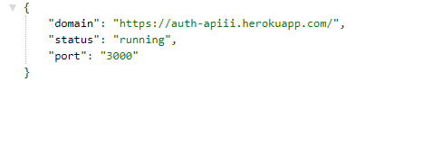
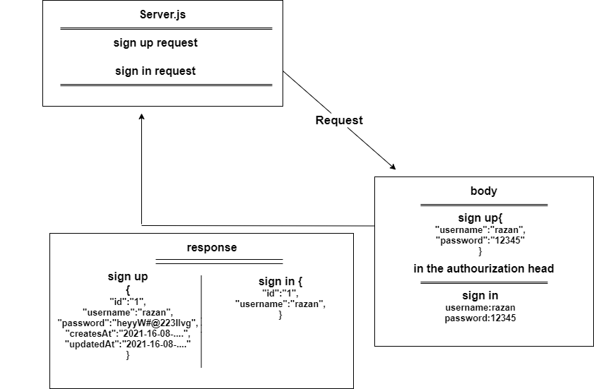

# Lab: Class 08

## auth-api

### Deployment Link
- https://auth-apiii.herokuapp.com/

### Author: Razan Alamleh
 - [test report](https://github.com/Razan-am/auth-api/runs/3389321752?check_suite_focus=true)
 - [front end](https://auth-apiii.herokuapp.com/status)

### Setup
- .env requirements
  - PORT - 3000

### Running the app
- npm start
  - Endpoint: /status
    - Returns Object

    

### Tests
- Unit Tests: npm run test

### UML

### Notes
- pull request : https://github.com/Razan-am/bearer-auth/pull/3
- How do I install the app or library?
  - Clone the repo to your local machine
  - in the terminal, `run npm i`
  - Create `.env` file with port name as the one in the `env samples` 
  - Create database called `lab8` 
  - Seed the database for the user and foor and clothes models with post request 
  - send sign up post request with username and password  
  - send log in post request with user name and the password 
 

- How do I test the app or library?
1.  in the termenal run `npm run test`
2. in the browser hit `localhost:yourPortNumber/`